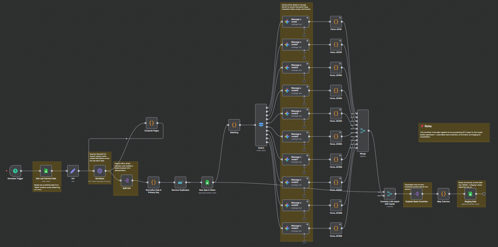

# Supply Chain Risk Radar — Skeleton (n8n → Sheets → Looker)

A simple, public-safe snapshot: the n8n workflow JSON (with secrets removed) + one diagram. It ingests global news (SerpAPI Google News), classifies supply-chain disruptions via Gemini, and stages tidy rows in Google Sheets for a Looker Studio map and trends.

## What this repo is (and isn’t)
- ✅ **Showcase-first:** read the JSON, see the flow, import if you want.
- ✅ **No secrets:** SerpAPI/Gemini/Sheets IDs are placeholders.
- ❌ Not a turn-key deploy script.

## Run it yourself (5 steps)
1. **Import** `workflow/risk-radar-skeleton.json` into n8n.
2. **Create a Google Sheet** with tabs `Raw` and `Staging` (match your headers).
3. **Set env vars** in n8n (or edit the node values):
   - `SERPAPI_KEY=<your key>`
   - `SHEETS_DOC_ID=<your Google Sheet ID>`
4. **Link credentials** in n8n for Google Sheets and Gemini.
5. **Execute workflow**, then (optional) connect Looker Studio to the `Staging` tab.

## Notes
- The HTTP Request node “Get News” uses `api_key={{ $env.SERPAPI_KEY }}`.
- All credential blocks were removed; n8n will prompt you to link yours.
- If you prefer blanks over env placeholders, edit the JSON and set the `api_key` value to `""` and the `documentId.value` to `""` before import.

## Demo (author’s instance)
- Looker: https://lookerstudio.google.com/s/ntUlLIypq1g
